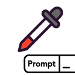

# Prompt Picker



A Chrome extension that helps you organize, search, and quickly use your favorite prompts with ChatGPT and other AI assistants.

## Description

Prompt Picker is a lightweight Chrome extension that serves as your personal prompt library. Type a keyword, pick a prompt from your collection, and copy it to your clipboard or insert it directly into ChatGPT with just one click.

## Features

- **Quick Search**: Quickly filter your prompts by typing keywords
- **Direct Insertion**: Option to automatically insert prompts into the ChatGPT input field
- **Easy Management**: Add, edit, delete, and reorder your prompt library
- **Import/Export**: Share your prompt collections via text files
- **Drag and Drop**: Reorder your prompts using intuitive drag and drop interface
- **Lightweight**: Minimal UI with low resource usage

## Installation

### From Chrome Web Store
1. Visit [Prompt Picker on the Chrome Web Store](#) *(link to be added)*
2. Click "Add to Chrome"
3. Confirm the installation when prompted

### Manual Installation (Developer Mode)
1. Download or clone this repository
2. Open Chrome and navigate to `chrome://extensions/`
3. Enable "Developer mode" in the top-right corner
4. Click "Load unpacked" and select the `dist` folder from this repository
   - If you don't have a `dist` folder, see the Development section below to build it

## Usage

### Basic Usage
1. Click the Prompt Picker icon in your Chrome toolbar
2. Browse your prompt library or search for specific prompts
3. Click any prompt to copy it to your clipboard
4. Toggle "Insert directly into ChatGPT" to automatically paste prompts into ChatGPT

### Adding Prompts
- **Quick Add**: Enter a new prompt in the "New prompt here..." field in the popup and click "Add"
- **Manage Library**: Click the gear icon (⚙️) to open the options page for full prompt management

### Managing Your Library
1. Click the gear icon (⚙️) in the popup to open the options page
2. Add, edit, delete, or reorder your prompts
3. Use drag and drop to change the order of your prompts
4. Import or export your prompt library as a text file

## Development

### Prerequisites
- [Node.js](https://nodejs.org/) (v14 or later recommended)
- npm (included with Node.js)

### Setup
1. Clone the repository
   ```
   git clone https://github.com/yourusername/prompt-picker.git
   cd prompt-picker
   ```

2. Install dependencies
   ```
   npm install
   ```

3. Build the extension
   ```
   npm run build
   ```
   This will create a `dist` directory with the built extension.

4. For development with auto-rebuild:
   ```
   npm run dev
   ```

### Project Structure
- `src/`: Source code
  - `manifest.json`: Extension manifest
  - `assets/`: Icons and images
  - `pages/`: UI pages
    - `popup/`: Extension popup UI
    - `options/`: Options page UI
  - `shared/`: Shared utilities
- `dist/`: Build output (generated)

## Import/Export Format

The import/export feature uses a simple text file format:
- One prompt per line
- Blank lines are ignored

Example:
```
Write a poem about [topic]
Explain [concept] as if I were 5 years old
Analyze the following code: [code]
```

## Permissions

This extension requires:
- `clipboardWrite`: To copy prompts to your clipboard
- `storage`: To save your prompts and preferences
- `downloads`: For exporting prompts as text files
- `activeTab`: To insert prompts into ChatGPT
- `scripting`: To execute scripts for direct insertion

## Browser Compatibility

- Chrome: v88 or later (uses Manifest V3)
- Edge: Compatible (Chromium-based)
- Firefox: Not currently supported (would require Manifest V2)

## License

This project is licensed under the MIT License - see the LICENSE file for details.

## Author

Hoa Do

## Acknowledgments

- Icon made with Canvas

